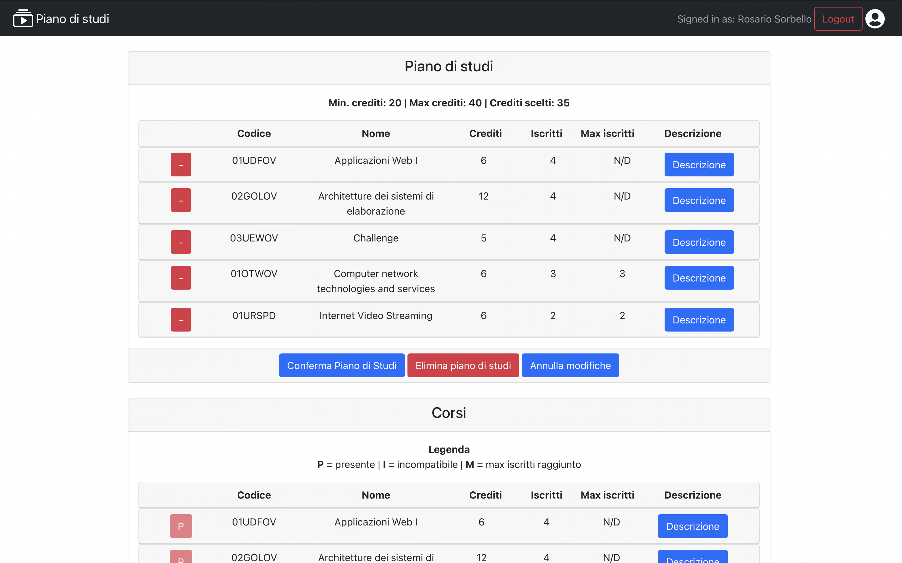

# Exam #1: Piano di Studi

## Student: s300733 ATANASIO GIUSEPPE

## React Client Application Routes

- Route `/`: contiene una lista di tutti i corsi disponibili, con relative descrizioni espandibili da bottone.

- Route `/home`: contiene sia la lista dei corsi disponibili (segnati in base al loro stato come si può riscontrare da legenda (**P** = presente nel piano di studi, **I** = incompatibile, **M** = massimo iscritti raggiunto) con relative descrizioni espandibili da bottone, che una sezione "Piano di studi".<br/>In quest'ultima compare, se esiste, un piano di studi (in modalità Full Time/Part Time) con intestazione i relativi crediti massimi, minimi e presenti nella lista del piano di studi dell'utente, altrimenti viene chiesto all'utente di crearne uno cliccando sui relativi bottoni Full Time o Part Time.<br/>N.B. Per creare il piano di studi non basta cliccare sui bottoni citati in precedenza, ma serve rispettare i vincoli di crediti.

- Route `/login`: pagina di login, in cui è presente un form dove mettere username e password. L'azione di login sarà scaturita da un bottone che, nel caso di buon fine, rimanda alla pagina `/home` facendo apparire un toast di conferma. Se lo username non è validato, verrà notificato sul campo stesso, mentre se la validazione passa tutti i controlli e l'utente non esiste apparirà un toast con messaggio di errore.

## API Server

### Corsi

#### GET `/api/courses`

* Restituisce la lista generica dei corsi
* **Request header has a line**: `Content-Type: application/json`
* **Request body**: vuoto
* **Request response**: `200 OK` (success); body: array di oggetti, e ognuno di essi presenta id, name, max_students, propedeuticity, cfu, enrolled, incompatibles.
* **Response body**:

```
[
  ...,
  {
    "id": "01SQMOV",
    "name": "Data Science e Tecnologie per le Basi di Dati",
    "max_students": null,
    "propedeuticity": null,
    "cfu": 8,
    "enrolled": 0,
    "incompatibles: ["01SQJOV", "01SQLOV"]
  }
]
```

* **Error responses**:  `500 Internal Server Error` (errore generico).

### Piano di Studi

#### GET `/api/studyPlan/:student_id`

* Restituisce la lista dei corsi nel piano di studi dell'utente
* **Request header**: `req.params.student_id` per ricevere il piano di studi relativo allo studente, e ha una riga `Content-Type: application/json`
* **Request body**: vuoto
* **Request response**: `200 OK` (success); body: array di oggetti, e ognuno di essi presenta id, name, max_students, propedeuticity, cfu, enrolled, incompatibles.
* **Response body**:

```
[
  ...,
  {
    "id": "01SQMOV",
    "name": "Data Science e Tecnologie per le Basi di Dati",
    "max_students": null,
    "propedeuticity": null,
    "cfu": 8,
    "enrolled": 0,
    "incompatibles: ["01SQJOV", "01SQLOV"]
  }
]
```

* **Error responses**:  `401 Unauthenticated user` (non loggato oppure permessi sbagliati), `500 Internal Server Error` (errore generico).

#### POST `/api/addToStudyPlan/:student_id/:isFullTime`

* Aggiorna il piano di studi relativo all'utente corrispondente a `student_id`, e se non esiste un piano di studi lo crea modificando i relativi flag `isFullTime` dell'utente.
* **Request header**: `req.params.student_id` per aggiornare il piano di studi relativo allo studente, `req.params.isFullTime` per creare, se non esiste, un piano di studi in modalità part-time o full-time, e ha una riga `Content-Type: application/json`
* **Request body**:

```
[
  ...,
  {
    "id": "01SQMOV",
    "name": "Data Science e Tecnologie per le Basi di Dati",
    "max_students": null,
    "propedeuticity": null,
    "cfu": 8,
    "enrolled": 0,
    "incompatibles: ["01SQJOV", "01SQLOV"]
  }
]
```

* **Request response**: `201 created` (success); body: empty.
* **Response body**: empty

* **Error responses**: `401 Unauthenticated user` (non loggato oppure permessi sbagliati), `422 Validation Error` (validation di body, parametri, vincoli di crediti e di iscritti fallita), `500 Internal Server Error` (errore generico).

#### DELETE `/api/deleteStudyPlan/:student_id`

* Elimina il piano di studi relativo all'utente corrispondente a `student_id`.
* **Request header**: `req.params.student_id` per eliminare il piano di studi relativo allo studente, e ha una riga `Content-Type: application/json`
* **Request body**: vuoto
* **Request response**: `201 No content` (success); body: vuoto.
* **Response body**: empty

* **Error responses**: `401 Unauthenticated user` (non loggato oppure permessi sbagliati), `422 Validation Error` (validation di `student_id` fallita), `500 Internal Server Error` (errore generico).

### Sessione

#### GET `/api/sessions/current`

* Check se l'utente è loggato o meno
* **Request header has a line**: `Content-Type: application/json`
* **Request body**: vuoto
* **Request response**: `200 OK` (success); body: .
* **Response body**: vuoto

* **Error responses**:  `401 Unauthenticated user` (non loggato oppure permessi sbagliati), `500 Internal Server Error` (errore generico).

#### POST `/api/sessions`

* Effettua il login
* **Request header has a line**: `Content-Type: application/json`
* **Request body**:

```
{
  "username": "testuser@polito.it",
  "password": "testpassword"
}
```

* **Request response**: `200 OK` (success); body: un oggetto contenente id, username, name, isFullTime, hasStudyPlan.
* **Response body**: 

```
{
  id: 4,
  username: 'testuser@polito.it',
  name: 'Rosario Sorbello',
  isFullTime: 0,
  hasStudyPlan: 1
}
```

* **Error responses**:  `401 Unauthenticated user` (non loggato e/o credenziali non valide), `500 Internal Server Error` (errore generico).

#### DELETE `/api/sessions/current`

* Effettua il logout
* **Request header has a line**: `Content-Type: application/json`
* **Request body**: vuoto

* **Request response**: `200 OK` (success); vuoto.
* **Response body**: vuoto

* **Error responses**:  `401 Unauthenticated user` (non loggato e/o credenziali non valide), `500 Internal Server Error` (errore generico).

## Database Tables

- Table `users` - contiene: id, email, name, surname, isFullTime, hasStudyPlan, hash, salt.
- Table `courses` - contiene: id, name, max_students, propedeuticity, cfu.
- Table `study_plan` - contiene: student_id, course_id. (Bridge Table)
- Table `incompatibles` - contiene: course_id, incompatible. (Bridge Table)

## Main React Components

- `Courses` (in `CourseList.js`): contiene `CourseTable` e una legenda se l'utente è loggato (**P** = presente | **I** = incompatibile | **M** = max iscritti raggiunto)

- `CourseTable` (in `CourseList.js`): contiene una lista di `CourseRow` e un'intestazione dei loro valori: *codice, nome, crediti, iscritti, max iscritti, descrizione*.

- `CourseRow` (in `CourseList.js`): contiene le informazioni del corso, di cui le ultime due appaiono a comparsa cliccando il bottone Descrizione: *codice, nome, crediti, iscritti, max iscritti, incompatibili, propedeutico*.<br/> Permette di espandere una descrizione contenente i corsi incompatibili e il relativo propedeutico grazie al bottone del component `CustomToggle`.<br/>In particolare, se l'utente è loggato, fa apparire dei bottoni a sinistra, che sono blu col + se permettono l'aggiunta nel piano di studi, altrimenti rossi e disabilitati in cui compaiono delle iniziali secondo una legenda che appare nel component `Courses`, come visto sopra.

- `CustomToggle` (in `CourseList.js`): gestisce il toggle dell'accordion permettendo di sostituire il comportamento di default di quest'ultimo col click di un bottone.

- `StudyPlan` (in `StudyPlan.js`): compare soltanto se l'utente è loggato. Se l'utente non ha un piano di studi compaiono due bottoni per chidedere se si vuole creare un piano di studi in modalità full time o part time, per poi far apparire una riga con max-min crediti validi per poter confermare il piano di studi e la somma dei crediti fatta sui corsi inseriti. Inoltre, appaiono 3 bottoni nella parte inferiore del component: "Conferma Piano di Studi", "Elimina Piano di Studi", "Annulla Modifiche" (quest'ultimo appare soltanto nel caso di modifiche temporanee effettuate al piano di studi). <br/> In caso di piano di studi già presente, appaiono sia l'header che la riga come detto precedentemente, più `SPTable`.

- `SPTable` (in `StudyPlan.js`): contiene una lista di `SPRow` e un'intestazione dei loro valori: *codice, nome, crediti, iscritti, max iscritti, descrizione*.

- `SPRow` (in `StudyPlan.js`): contiene le informazioni del corso, di cui le ultime due appaiono a comparsa cliccando il bottone Descrizione: *codice, nome, crediti, iscritti, max iscritti, incompatibili, propedeutico*. <br/> È presente un bottone rosso col segno '-' che permette di rimuovere il corso da `SPTable`.

- `MyNavbar` (in `MyNavbar.js`): navbar contenente un bottone login/logout con accanto un icona utente, il titolo dell'applicazione con l'icona di un libro.

## Screenshot



## Users Credentials

N.B. La password è la stessa per tutti gli utenti e compare già come placeholder di default nel login, fatto appositamente per evitare di inserirla manualmente per il testing.

| Username | Password | Iscritto | Tipo d'iscrizione |
|:--------:|:--------:|:--------:|:--------------:|
| testuser@polito.it | testpassword | Sì | Part-time |
| u2@p.it | testpassword | Sì | Part-time |
| u3@p.it | testpassword | Sì | Part-time |
| u4@p.it | testpassword | No |     /     |
| u5@p.it | testpassword | Sì | Full-time |
